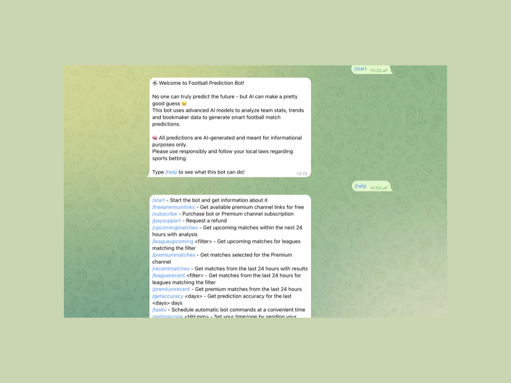
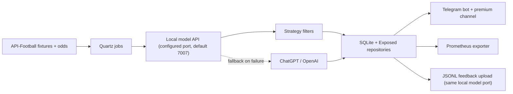
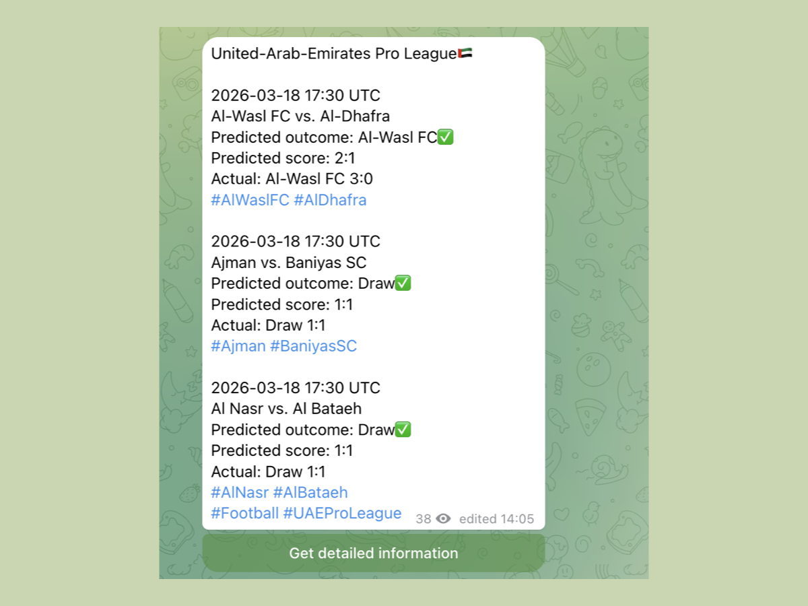
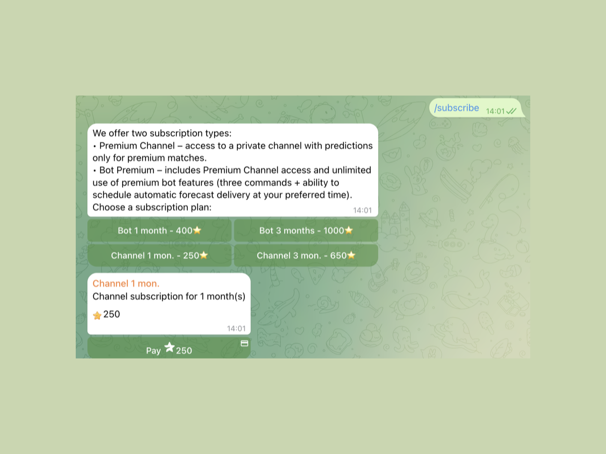
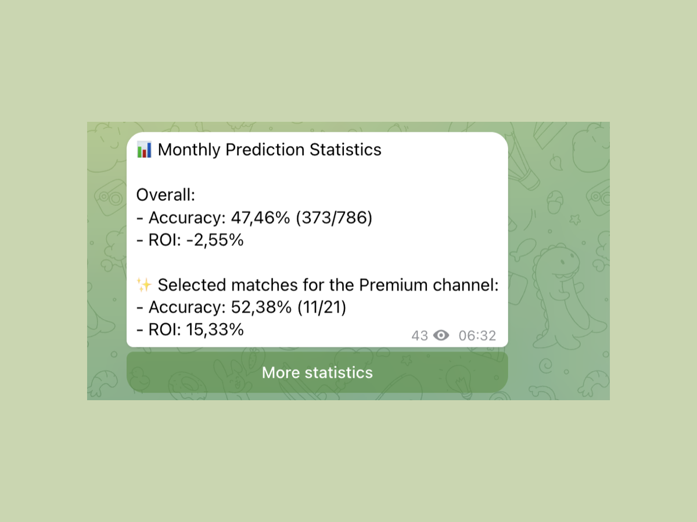

# BetPredictionBot

AI-powered Telegram bot for football predictions with a local model, ChatGPT fallback, scheduled data pipelines, premium monetization, and Prometheus metrics.

**What it does**
- Pulls football fixtures and odds, generates predictions, and publishes them to Telegram.
- Separates free and premium match flows, including subscriptions, invite links, and refund handling.
- Tracks accuracy and ROI over time and exposes operational metrics for monitoring.

**Why it is technically interesting**
- Hybrid prediction flow: `API-Football -> local model -> ChatGPT fallback -> strategy filtering -> Telegram delivery`.
- Product-minded backend, not just a demo bot: paid access, user time zones, scheduled jobs, feedback loop, and observability.
- Kotlin codebase with clear layers for bot logic, integrations, repositories, DTOs, and automation.

**Stack**
`Kotlin` `Telegram Bots API` `API-Football` `OpenAI` `local model API` `Quartz` `SQLite` `Exposed` `Prometheus` `Gradle`



Human-facing docs live in this file and in [docs/product-overview.md](docs/product-overview.md). AI-oriented repository context lives in [AGENTS.md](AGENTS.md) and the markdown files under `src/main/kotlin/**`.

`BetPredictionBot` was built as a working product first. This repository is now structured to be easier to review, but the bot itself already includes the real delivery, payment, scheduling, evaluation, and monitoring flows used by the project.

## What I built

- A Telegram bot that delivers upcoming matches, recent results, premium picks, and accuracy summaries.
- A hybrid prediction pipeline that prefers a local football model and falls back to ChatGPT when the local service is unavailable.
- A premium flow with Telegram Stars payments, invite-link management, refunds, and gated command limits.
- Quartz-based automation for match fetching, result updates, premium summaries, league predictability refreshes, and model-data uploads.
- SQLite persistence with Exposed repositories for matches, subscriptions, payments, scheduled jobs, invites, refunds, and poll history.
- Prometheus metrics for commands, user counts, job operations, and refund operations.

## Architecture



- `Main.kt` boots the Telegram bot, metrics server, and all recurring Quartz jobs.
- `FootballBot.kt` is the product layer: commands, paid flows, scheduled delivery, accuracy messaging, and admin operations.
- `service/` contains external integrations and business logic.
- `repository/` persists operational state and historical match data.
- `dto/` stores transport models, strategy configs, and API schemas.

## AI Side / Prediction Pipeline

- `Data sources`: upcoming and historical fixtures come from API-Football; odds are refreshed close to kickoff; user/payment/invite events come from Telegram.
- `Local model`: the primary predictor is `HttpLocalModelService`, which calls `http://localhost:<local.model.port>/predict` with `7007` as the default port and stores win probabilities, expected goals, calibration fields, and match-count context.
- `ChatGPT`: `ChatGPTService` is a fallback path. If the local model does not return a prediction, the bot retries against OpenAI and parses a structured response back into `MatchInfo`.
- `Strategy selection`: premium picks are not arbitrary. `StrategyService` filters matches by predicted outcome, probability thresholds, expected-goal constraints, and bookmaker odds.
- `Accuracy`: the current code measures outcome accuracy and ROI over rolling periods, plus strategy-only accuracy/ROI and per-outcome breakdowns. Daily, weekly, monthly, and yearly summary jobs are already wired.
- `Feedback loop`: after matches finish, results are fetched back into SQLite. Completed labeled matches are exported to JSONL and uploaded to the local model on a recurring schedule so the model service can ingest fresh historical data.

More detail is in [docs/ai-side.md](docs/ai-side.md).

## Scheduling & automation

The repository already demonstrates backend automation rather than manual operation:

- Fetch new matches every 4 hours.
- Update match posts shortly after fetch windows.
- Refresh past results daily.
- Update live matches every 10 minutes.
- Recompute league predictability daily.
- Send daily, weekly, monthly, and yearly accuracy reports.
- Send a daily premium summary.
- Upload model training data at 03:00 on Monday/Wednesday/Friday in production, or Tuesday/Thursday/Saturday when `test=true`.
- Clean up invite links hourly.
- Run user-defined scheduled tasks with stored time zones.

## Persistence

- SQLite is used as the operational store, with Exposed repositories wrapping access.
- Match data is stored per league and enriched over time with predictions, odds, actual outcomes, message ids, and calibration fields.
- Separate repositories handle subscriptions, payments, refunds, invite links, user settings, scheduled jobs, polls, and command-usage limits.
- The same store powers both end-user features and analytics such as predictability, accuracy, and ROI.

## Monitoring

- Prometheus metrics are exposed by `Metrics.kt`.
- Current counters and gauges include `bot_commands_total`, `bot_job_operations_total`, `bot_refund_operations_total`, `bot_users_total`, and `bot_users_active_last_day`.
- This makes the project easier to position as a maintainable backend service instead of a one-off Telegram script.

## Demo / screenshots

The repository includes real cropped screenshots from the bot flows and reporting messages so the feature set is visible directly from the README.

### Telegram bot


### Prediction example



### Premium / paid flow



### Metrics / accuracy preview



## Setup

### Prerequisites

- JDK 17
- Telegram bot token and chat ids
- API-Football token
- OpenAI API key for fallback mode
- Local model service running on `localhost` at the configured `local.model.port` (`7007` by default)

### Quick start

```bash
cp config.example.properties config.properties
./gradlew test
./gradlew run
```

### Configuration

Use [config.example.properties](config.example.properties) as the starting point. Current keys used by the application:

- `telegram.bot.token`
- `admin.chat.id`
- `channel.chat.id`
- `strategy.channel.id`
- `bot.name`
- `metrics.port`
- `api-football.token`
- `chatgpt.api.key`
- `provider.token`
- `test`
- `local.model.port`
